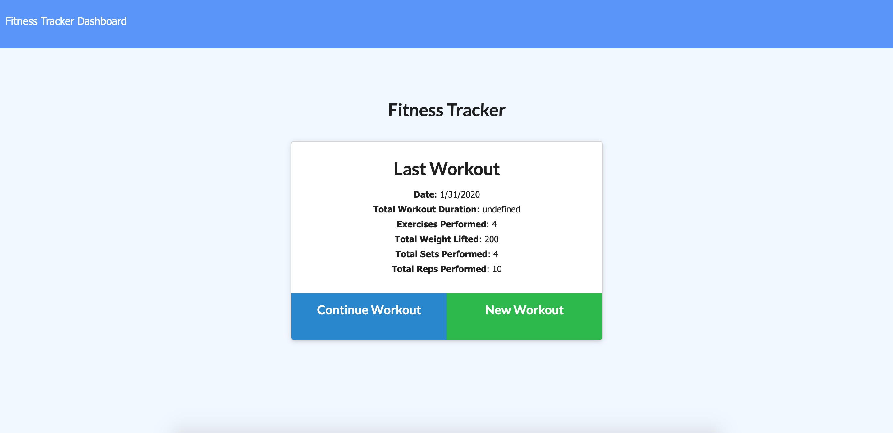

# workoutTracker

A Workout Tracker that allows the user to be able to view, create, and track daily workouts. The user can log multiple exercises in a workout on a given day, and also track the name, type, weight, sets, reps, and duration of exercise.

https://aqueous-stream-06650.herokuapp.com/

